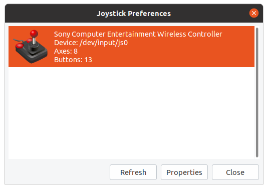

hid-sony-clone-dkms
===================

Workaround to when connecting a ds4 joystick controller clone through
USB and the kernel gives:

    failed to retrieve feature report 0x81 with the DualShock 4 MAC address

    lsusb

    Bus 001 Device 008: ID 054c:05c4 Sony Corp. DualShock 4 [CUH-ZCT1x]

# disconnect & stop apps

Before installing this package, **disconnect** joystick controllers and **exit** all application that could be using it (e.g. `jstest-gtk` ), check with

    lsmod |grep -i hid_sony

The package will unload the original `hid_sony` kernel module and blacklist it.

# install

    sudo apt-get install gdebi-core
    sudo gdebi hid-sony-clone-dkms_0.0.1_all.deb

# testing

- Connect ds4 joystick through USB
- Test with jstest-gtk

        jstest-gtk

You should see something like:

# build ( ubuntu 20.04 / linux 5.4.x )

    dpkg-buildpackage -us -uc

# references

[hid-sony-clone-fix-dkms](https://github.com/Kyuunex/hid-sony-clone-fix-dkms)
